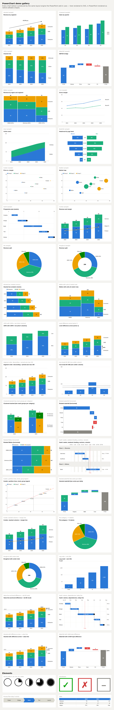

# PowerChart

An open-source, think-cell-style chart add-in for PowerPoint, built on **Office.js**.

PowerChart gives you the charts consultants reach for think-cell to make — waterfalls,
Mekko/Marimekko, stacked and clustered columns, 100% charts, lines and areas — with
think-cell's signature annotations (**CAGR arrows, difference arrows, value lines,
column totals, smart segment labels**), inserted into the slide as **native, fully
editable PowerPoint shapes**, never pictures or opaque OLE objects.



## Feature overview

| think-cell feature | PowerChart |
|---|---|
| Stacked / clustered / 100% column charts | ✅ |
| Bar charts as rotated column charts, butterfly charts | ✅ (`horizontal` toggle, `butterfly` kind) |
| Waterfall with computed totals (`e` cells) and connectors | ✅ |
| Mekko (Marimekko) with %-axis and column totals | ✅ |
| Mekko with units (`X extent` row) | ✅ |
| Line & area charts | ✅ |
| Smart segment labels (auto-hidden when they don't fit, auto contrast ink) | ✅ |
| Column totals | ✅ |
| CAGR arrow (`+x.x% p.a.`) | ✅ |
| Total & level difference arrows (%/absolute delta) | ✅ |
| Value lines (multiple; fixed values or mean Ø) | ✅ |
| Series labels placed at the last column (de-overlapped) | ✅ |
| Excel-style datasheet with TSV paste, transpose, `100%=` row | ✅ (task pane grid) |
| Scatter & bubble with collision-avoiding point labels | ✅ (`X`/`Y`/`Size`/`Group` rows) |
| Gantt / timeline (numeric) with milestones | ✅ (`Start`/`End`/`Milestone` rows) |
| Segment order menu (sheet / reversed / ascending / descending) | ✅ |
| Manual value-axis scale (pin min and/or max) | ✅ |
| Number format control (decimals, suffix) | ✅ |
| Agenda / chapter slides (one per chapter, current highlighted) | ✅ (appended to the deck) |
| Visual chart gallery (Elements-style thumbnails) | ✅ |
| Output as native, editable PowerPoint shapes | ✅ (grouped) |
| Re-edit inserted charts (config persisted in shape tags) | ✅ ("Edit selected chart") |
| Live Excel data links, calendar-based Gantt, axis breaks, Same Scale | 🚧 roadmap |

## How it works

```
datasheet / config ──▶ layout engine (pure TS) ──▶ scene graph ──▶ SVG renderer (preview, tests)
                                                              └──▶ Office.js renderer (native shapes)
```

- **`src/core`** — the layout engine. Pure TypeScript, no Office.js dependency:
  chart layouts, value scales with nice ticks, label fitting/contrast, decorations.
  Deterministic and fully unit-testable.
- **`src/render/svg.ts`** — renders a scene to SVG for the live preview, the demo
  gallery, and visual tests.
- **`src/render/powerpoint.ts`** — renders the same scene as native PowerPoint
  shapes via the Office.js Shape API (`addGeometricShape`, `addLine`, `addTextBox`),
  then groups them. Every bar, label and arrow stays editable in PowerPoint.
- **`src/taskpane`** — the add-in UI: chart gallery, editable datasheet (paste
  straight from Excel), decoration toggles, live preview, insert button.

See [docs/ARCHITECTURE.md](docs/ARCHITECTURE.md) for design details and
[docs/RESEARCH.md](docs/RESEARCH.md) for the deep research on think-cell that
informed this clone.

## Getting started

```bash
npm install
npm run dev        # http://localhost:3000 — demo gallery (no PowerPoint needed)
npm test           # unit tests for the layout engine
npm run build      # production bundle
```

### Try it without PowerPoint

Open `http://localhost:3000/` for the gallery, or
`http://localhost:3000/src/taskpane/taskpane.html` for the full task-pane UI —
outside PowerPoint the **Download SVG** button replaces slide insertion.

### Sideload into PowerPoint

1. Serve the add-in over HTTPS (`npx office-addin-dev-certs install`, then point
   `server.https` in `vite.config.ts` at the generated certs).
2. Sideload `manifest.xml`:
   - **PowerPoint on the web**: Insert → Add-ins → Upload My Add-in.
   - **Windows/Mac desktop**: see the
     [Office add-in sideloading docs](https://learn.microsoft.com/office/dev/add-ins/testing/test-debug-office-add-ins).
3. Open the **PowerChart** button on the Home tab, pick a chart, paste data,
   and hit **Insert into slide**.

Requires PowerPoint with **PowerPointApi 1.4+** (Microsoft 365 desktop or web).
Grouping uses 1.8+ and arrowhead rotation 1.9+ when available; both degrade
gracefully on older hosts.

## Datasheet conventions

- Row 1 = category names, column A = series names — the same mental model as
  think-cell's internal datasheet. **⇄ Transpose** swaps the two.
- Paste a range straight from Excel (TSV) into any cell.
- **Waterfall**: one series of deltas; type `e` (or `=`) in a cell to draw a
  computed running total at that category, exactly like think-cell's `e` cells.
- **`100%=` row**: name a row `100%=` to set per-category denominators for
  100% charts — columns whose series sum to less stay short of full height.
- **`X extent` row**: name a row `X` or `X extent` to give a Mekko explicit
  column widths (think-cell's "Mekko with units").
- **Re-editing**: select an inserted PowerChart on the slide and press
  **Edit selected chart** — the pane reloads its data and "Update chart"
  replaces it in place.

## Disclaimer

PowerChart is an independent open-source project. It is not affiliated with,
endorsed by, or derived from think-cell Software GmbH. "think-cell" is a
trademark of its owner; it is referenced here only to describe compatibility
of concepts.
